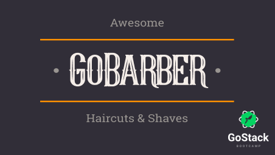

<div align="center">

# GoBarber Mobile

## Barbershop scheduling and management platform




<space><space>

<space><space>

<space><space>
[](https://github.com/leo-schlanger/gobarber-mobile/blob/master/LICENSE)

</div>

- [Description](#description)
- [Technologies](#technologies)
- [How to use](#how-to-use)
- [How to contribute](#how-to-contribute)
- [License](#license)

<a id="description" />

# :book: Description

An application developed in React-Native using typescript language with the purpose of facilitating the service scheduling of barbers. It will store all customers and barbers and book appointments. Application developed in Rocketseat's GoStack Bootcamp. :rocket:

This application works together with 2 other applications, these are:

- [:file_cabinet: GoBarber API](https://github.com/leo-schlanger/gobarber-backend)
- [:computer: GoBarber Web](https://github.com/leo-schlanger/gobarber-frontend)

---

<a id="technologies" />

# :rocket: Technologies

- [react-native](https://reactnative.dev/)
- [GoBarber API](https://github.com/leo-schlanger/gobarber-backend)
- [Axios](https://github.com/axios/axios)
- [Unform](https://github.com/Rocketseat/unform)
- [react navigation](https://reactnavigation.org/)
- [async-storage](https://github.com/react-native-community/async-storage)
- [styled-component](https://styled-components.com/)
- [date-fns](https://date-fns.org/)
- [datetimepicker](https://github.com/react-native-community/datetimepicker)
- [react-native-image-picker](https://github.com/react-native-community/react-native-image-picker)
- [yup](https://github.com/jquense/yup)

---

<a id="how-to-use" />

# :gear: How to use

Before running this application it is necessary to have the GoBarber API running, if you don't have it [click here](https://github.com/leo-schlanger/gobarber-backend).

With the backend application running, remember to have a device emulator running or a mobile device connected to your machine. Having it connected, modify in the file "services/api.ts" putting in place of "localhost" the ip of your machine where the backend is running. If you are using android studio adb you can skip this step and just put the following command in the terminal:

```Bash
$ adb reverse tcp:3333 tcp:3333
```

After, just follow the commands below in the terminal to start:

```Bash
# Install all dependencies
$ yarn install

# Run Application
$ yarn start

# Install Application in device
$ yarn android or yarn ios
```

---

<a id="how-to-contribute" />

# :pushpin: How to contribute

Fork this repository.

```bash
# Clone the repository
$ git clone <repository-url> && cd <repository-folder>

# Create a branch with your feature or bug fix
$ git checkout -b <my-branch>

# Commit your changes
$ git commit -m 'feature/bugfix: my changes description'

# Push to your branch
$ git push origin <my-branch>
```

After the merge of your pull request is done, you can delete your branch.

---

<a id="license" />

# :memo: License

This project is under the MIT license. See the [LICENSE](https://github.com/leo-schlanger/gobarber-mobile/blob/master/LICENSE) for more information.

---

Made by Leo Schlanger :wave: [Get in touch!](https://www.linkedin.com/in/leo-schlanger-226467192/)
